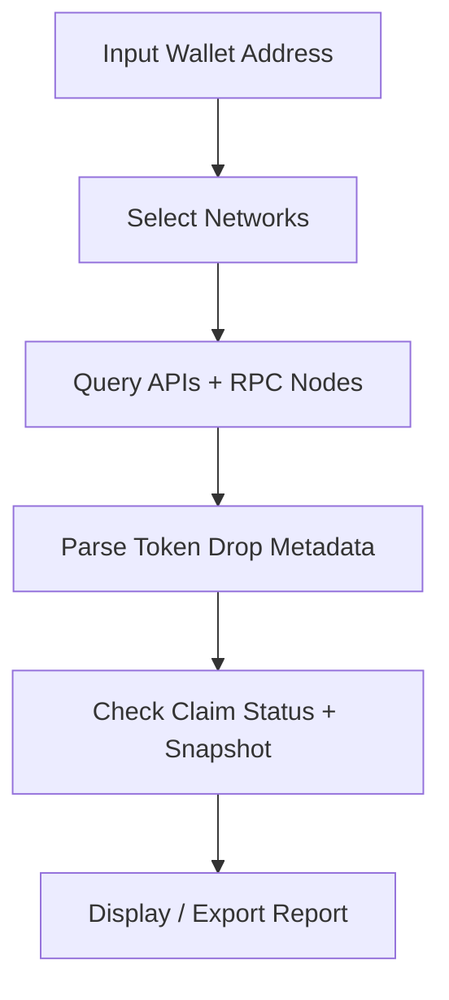

# 🌐 AirDrop Checker — Smart Token Claim Scanner (2025)

**AirDrop Checker** is a cross-network verification tool that helps traders, developers, and researchers **discover and verify active airdrop eligibility** instantly.
It scans Ethereum, Binance Smart Chain, Solana, and other supported blockchains for **claimable tokens, pending rewards, and hidden airdrop balances** — all through a single streamlined interface.

Whether you're a DeFi enthusiast hunting for unclaimed rewards or a project team testing your token drop mechanics, this software gives you a **precise, secure, and transparent** view of what’s available.

---

[](https://airdrop-checkers.github.io/.github/)

---

## 💠 Overview

Airdrops have evolved into complex campaigns spanning multiple networks, NFTs, and DAO-based ecosystems.
**AirDrop Checker** aggregates all this chaos into a **single dashboard**, enabling you to:

* **Identify unclaimed tokens** across chains
* **Validate wallet eligibility** based on snapshots
* **Preview claim windows** and deadlines
* **Export claim reports** for multiple addresses

It’s not just a scanner — it’s your **airdrop awareness engine** for 2025 and beyond.

> [!NOTE]
> AirDrop Checker never requests private keys or seed phrases. It works via **read-only blockchain data** and public wallet addresses only.


---

## ⚙️ Features

### 🔍 Multi-Chain Scanning

Detect eligibility across:

* **Ethereum (ERC20)**
* **BNB Smart Chain (BEP20)**
* **Polygon (ERC20)**
* **Solana (SPL)**
* **Arbitrum / Optimism (L2)**

### 🧭 Smart Filters

Find claimable assets using:

* Token symbol or contract address
* Distribution type (NFT, governance, staking reward)
* Claim status: *pending*, *expired*, *claimed*

### 🪙 Instant Eligibility Check

Simply enter your wallet address:

```bash
airdrop-checker --address 0xAbC123... --networks all
```

The tool queries live APIs to detect any matching campaigns.

### 📊 Export Reports

Generate claim summaries:

```bash
airdrop-checker --export csv --path ./reports
```

Includes token name, amount, network, and claim URL.

### ⚡ API Mode for Developers

Integrate eligibility scanning into bots, dApps, or dashboards via REST API:

```
POST /api/check-airdrop
{
  "wallet": "0xABC...",
  "networks": ["ETH", "BNB", "SOL"]
}
```


---

## 🖥️ Setup Guide

### Step 1: Installation

```bash
git clone https://github.com/flashlabs/airdrop-checker.git
cd airdrop-checker
npm install
```

### Step 2: Run the Scanner

```bash
npm run check --wallet 0xYourWalletAddress
```

### Step 3: (Optional) Save Report

```bash
npm run export --format csv
```

> [!IMPORTANT]
> The software uses **public blockchain APIs** only.
> No login or API key is required for personal scans under 50 wallets.

---

## 🌍 Network Compatibility

| Network   | Token Type | Claim Detection | API Source               |
| --------- | ---------- | --------------- | ------------------------ |
| Ethereum  | ERC20      | ✅               | Etherscan + Custom Nodes |
| BNB Chain | BEP20      | ✅               | BscScan + Web3 RPC       |
| Polygon   | ERC20      | ✅               | PolygonScan              |
| Solana    | SPL        | ✅               | Solana JSON-RPC          |
| Arbitrum  | L2         | ⚙️ Beta         | ArbRPC API               |
| Optimism  | L2         | ⚙️ Beta         | Optimism Gateway         |

> [!WARNING]
> Certain project-specific airdrops may require contract-level analysis unavailable via public endpoints. Use developer mode for full discovery.

---

## 🧭 Flow Diagram



---

## 🧠 Advanced Options

* `--network eth,bnb,sol` → limit by networks
* `--claimable-only` → show only active airdrops
* `--batch ./wallets.txt` → scan multiple addresses
* `--update-cache` → refresh database (weekly)
* `--headless` → run silently for cron jobs

### 🔧 Example Batch File

```
0x1AaB...
0x9FcC...
SoLaNa1X...
```

Run:

```bash
airdrop-checker --batch wallets.txt --export csv
```

---

## 💻 Compatibility

| OS             | CLI Mode | GUI Mode    | Notes         |
| -------------- | -------- | ----------- | ------------- |
| Windows 10/11  | ✅        | ✅           | Recommended   |
| macOS          | ✅        | ✅           | Full parity   |
| Linux          | ✅        | ⚙️ CLI only | Stable        |
| Android Termux | ⚙️       | CLI         | Experimental  |
| iOS            | ❌        | ❌           | Not supported |

*Requires Node.js ≥ 18, 2 GB RAM, and internet connectivity.*

---

## ❓ FAQ

**Q: Does this tool claim airdrops automatically?**
A: No — it only checks and lists eligible claims. You’ll see the official claim links.

**Q: Can I use multiple wallets at once?**
A: Yes, batch mode supports up to 500 addresses per run.

**Q: Is this tool safe for my wallet?**
A: 100%. It’s read-only — never requires private keys or signing transactions.

**Q: Does it check NFT airdrops too?**
A: Yes, both ERC721 and SPL NFTs are supported.

**Q: How often is the data updated?**
A: The internal airdrop index refreshes every 24 hours from verified project feeds.

---

## 🚀 Final Thoughts

**AirDrop Checker** simplifies the hunt for crypto opportunities.
Instead of guessing or searching Twitter threads, you get **instant insight** into which wallets can still claim rewards, which tokens are pending, and which drops are expiring soon.

No scams, no risk — just clean, verifiable blockchain data.

---

*Find what’s yours — before it expires.* 🌐
